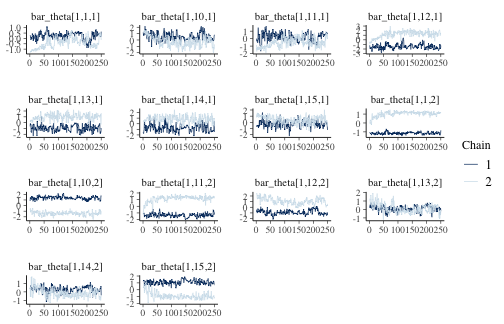
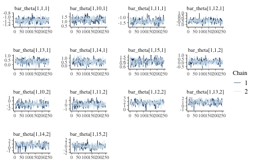

# Introduction

`dbmm` fits dynamic Bayesian measurement models using the programming
language [Stan](https://mc-stan.org/) via the R package
[cmdstanr](https://mc-stan.org/cmdstanr/). Currently, there are two supported
models. The first is a dynamic factor (DF) model for indicators of mixed type:
binary, ordinal, or metric [cf. @quinn04bayes_factor]. The second is a
multidimensional ordinal dynamic group-level item response theory (MODGIRT)
model [@berwick_caughey25dynam_multid]. Both models allow for multiple latent
factors (i.e., dimensions), usually but not necessarily orthogonal to one
another.

The typical use case for the DF model is to estimate a time-varying latent
variable (or multiple such variables) from a time series of multiple indicators
[e.g., measuring state policy conservatism using data on specific state
policies; @caughey_warshaw16dynam_state]. The typical use of the MODGIRT model
is to measure one or more latent variables (e.g., mass economic and cultural
conservatism) from aggregated responses to public opinion surveys.

The package includes functions to help users shape their data for the specific
requirements of `cmdstanr`, then provides custom fitting functions and a number
of post-fit helper functions for users to identify their models, assess
convergence, and plot output.

# Usage of MODGIRT

## Load and Shape Data


``` r
suppressPackageStartupMessages({
  library(dbmm)
  library(dplyr)
  library(tidyr)
  library(stringr)
  library(ggplot2)
  library(estsubpop)
  library(cmdstanr)
})
#> Error in `library()`:
#> ! there is no package called 'estsubpop'
```

This vignette uses data from @cavaille_two_2015, cleaned and merged with the
complete British Social Attitudes (BSA) survey. The full cleaning process is
documented in @berwick_caughey25dynam_multid. Here, we just use the cleaned
data, which is included with the package.


``` r
data <- readr::read_rds(
  system.file("extdata", "ct8611.rds", package = "dbmm")
)

str(data)
#> tibble [83,775 × 43] (S3: tbl_df/tbl/data.frame)
#>  $ serial             : chr [1:83775] "11284" "10235" "10200" "13852" ...
#>  $ year               : num [1:83775] 1986 1986 1986 1986 1986 ...
#>   ..- attr(*, "format.stata")= chr "%9.0g"
#>  $ wtfactor           : num [1:83775] 1 0.5 1 0.5 1 ...
#>   ..- attr(*, "format.stata")= chr "%9.0g"
#>  $ rsex               : Factor w/ 2 levels "Male","Female": 1 2 1 2 2 2 2 1 1 1 ...
#>  $ popq               : Factor w/ 4 levels "den_q1","den_q2",..: NA NA NA NA NA NA NA NA NA NA ...
#>  $ country            : Factor w/ 3 levels "England","Scotland",..: 1 1 1 1 1 1 1 1 1 1 ...
#>  $ agecat3            : Factor w/ 3 levels "18-34","35-59",..: 1 2 3 2 1 3 3 2 3 1 ...
#>  $ location           : Factor w/ 4 levels "Village or rural",..: 3 NA 2 3 NA NA 3 2 NA NA ...
#>  $ hhincqe            : Factor w/ 5 levels "inc_q1","inc_q2",..: 2 1 1 4 NA 1 3 3 4 5 ...
#>  $ university         : num [1:83775] 0 0 0 0 0 0 0 0 0 1 ...
#>  $ index              : num [1:83775] NA NA NA NA NA NA NA NA NA NA ...
#>   ..- attr(*, "format.stata")= chr "%9.0g"
#>  $ taxspendv2         : num [1:83775] 1 1 2 2 2 2 2 2 1 2 ...
#>   ..- attr(*, "label")= chr "RECODE of taxspend_n"
#>   ..- attr(*, "format.stata")= chr "%9.0g"
#>  $ welfhelpv2         : num [1:83775] NA NA NA NA NA NA NA NA NA NA ...
#>   ..- attr(*, "label")= chr "RECODE of welfhelp_n"
#>   ..- attr(*, "format.stata")= chr "%9.0g"
#>  $ welffeetv2         : num [1:83775] NA NA NA NA NA NA NA NA NA NA ...
#>   ..- attr(*, "label")= chr "RECODE of welffeet_n"
#>   ..- attr(*, "format.stata")= chr "%9.0g"
#>  $ sochelpv2          : num [1:83775] NA NA NA NA NA NA NA NA NA NA ...
#>   ..- attr(*, "label")= chr "RECODE of sochelp_n"
#>   ..- attr(*, "format.stata")= chr "%9.0g"
#>  $ richlawv2          : num [1:83775] 1 NA 3 2 NA NA 4 NA NA NA ...
#>   ..- attr(*, "label")= chr "RECODE of richlaw_n"
#>   ..- attr(*, "format.stata")= chr "%9.0g"
#>  $ redistrbv2         : num [1:83775] 2 NA 3 2 NA NA 5 NA NA NA ...
#>   ..- attr(*, "label")= chr "RECODE of redistrb_n"
#>   ..- attr(*, "format.stata")= chr "%9.0g"
#>  $ unempjobv2         : num [1:83775] NA NA NA NA NA NA NA NA NA NA ...
#>   ..- attr(*, "label")= chr "RECODE of unempjob_n"
#>   ..- attr(*, "format.stata")= chr "%9.0g"
#>  $ dolefidlv2         : num [1:83775] NA NA NA NA NA NA NA NA NA NA ...
#>   ..- attr(*, "label")= chr "RECODE of dolefidl_n"
#>   ..- attr(*, "format.stata")= chr "%9.0g"
#>  $ morewelfv2         : num [1:83775] NA NA NA NA NA NA NA NA NA NA ...
#>   ..- attr(*, "label")= chr "RECODE of morewelf_n"
#>   ..- attr(*, "format.stata")= chr "%9.0g"
#>  $ wealthv2           : num [1:83775] 2 NA 3 2 NA NA 4 NA NA NA ...
#>   ..- attr(*, "label")= chr "RECODE of wealth_n"
#>   ..- attr(*, "format.stata")= chr "%9.0g"
#>  $ indust4v2          : num [1:83775] 2 NA 2 3 NA NA 4 NA NA NA ...
#>   ..- attr(*, "label")= chr "RECODE of indust4_n"
#>   ..- attr(*, "format.stata")= chr "%9.0g"
#>  $ incomgapv2         : num [1:83775] 1 1 2 1 1 2 1 1 1 1 ...
#>   ..- attr(*, "label")= chr "RECODE of incomgap_n"
#>   ..- attr(*, "format.stata")= chr "%9.0g"
#>  $ dolev2             : num [1:83775] 3 1 3 3 1 3 3 1 1 2 ...
#>   ..- attr(*, "label")= chr "RECODE of dole_n"
#>   ..- attr(*, "format.stata")= chr "%9.0g"
#>  $ exclusion_un_only04: num [1:83775] NA NA NA NA NA NA NA NA NA NA ...
#>  $ welf_chavun_only04 : num [1:83775] NA NA NA NA NA NA NA NA NA NA ...
#>  $ depool_only04      : num [1:83775] NA NA NA NA NA NA NA NA NA NA ...
#>  $ ineq_accv2         : num [1:83775] NA NA NA NA NA NA NA NA NA NA ...
#>  $ damlivesv2         : num [1:83775] NA NA NA NA NA NA NA NA NA NA ...
#>  $ incdiffsv2         : num [1:83775] NA NA NA NA NA NA NA NA NA NA ...
#>  $ ineqrichv2         : num [1:83775] NA NA NA NA NA NA NA NA NA NA ...
#>  $ majtaxv2_only04    : num [1:83775] NA NA NA NA NA NA NA NA NA NA ...
#>  $ soctaxv2_only04    : num [1:83775] NA NA NA NA NA NA NA NA NA NA ...
#>  $ incdiffv2          : num [1:83775] 2 NA 3 2 NA NA 5 NA NA NA ...
#>  $ benfrsecv2_only04  : num [1:83775] NA NA NA NA NA NA NA NA NA NA ...
#>  $ diffsnecv2         : num [1:83775] NA NA NA NA NA NA NA NA NA NA ...
#>  $ nousesecv2_only04  : num [1:83775] NA NA NA NA NA NA NA NA NA NA ...
#>  $ falseclmv2         : num [1:83775] 4 5 NA 4 3 4 5 4 5 4 ...
#>  $ redist2v2_only04   : num [1:83775] NA NA NA NA NA NA NA NA NA NA ...
#>  $ socspnd1v2         : num [1:83775] NA NA NA NA NA NA NA NA NA NA ...
#>  $ socspnd4v2         : num [1:83775] NA NA NA NA NA NA NA NA NA NA ...
#>  $ taxraisev2         : num [1:83775] NA NA NA NA NA NA NA NA NA NA ...
#>  $ whyneedv5          : num [1:83775] 0 NA 0 0 NA NA 1 1 NA NA ...
```

To understand where to go from here, it's useful to examine what the package
functions expect. There are two steps. First, we *shape* the data into the
expected format, then *fit* the model on that formatted data. `dbmm` will do
some of the shaping for us, but there are often some initial cleaning steps
required of your raw data. Below, the code for shaping and then fitting the
model are shown. Of note, we'll need to convert our data to "long" format
(more on that later), identify each of the names of the columns containing
time, unit, item, value, and weight variables, and decide on the number of
factors to fit.


``` r
# shape panel data  -------------------------------------------
data_shaped <- shape_modgirt(
  long_data = data_long,
  time_var = time_var,
  unit_var = "group",
  item_var = "item",
  value_var = "response",
  weight_var = "wtfactor"
)

# fit panel model ------------------------------------------------
modgirt_out <- fit_modgirt(
  stan_data = data_shaped,
  n_factor = n_dim
)
```

Now, we proceed to cleaning the data up for the shaping function. In its
current format, each row represents one response to the BSA survey in a given
year. However, `dbmm` requires that data is passed in a "long" format, where
each row instead represents a response to a single item in a survey in a given
year.


``` r
head(data)
#> # A tibble: 6 × 43
#>   serial  year wtfactor rsex   popq  country agecat3 location hhincqe university index
#>   <chr>  <dbl>    <dbl> <fct>  <fct> <fct>   <fct>   <fct>    <fct>        <dbl> <dbl>
#> 1 11284   1986      1   Male   <NA>  England 18-34   Suburban inc_q2           0    NA
#> 2 10235   1986      0.5 Female <NA>  England 35-59   <NA>     inc_q1           0    NA
#> 3 10200   1986      1   Male   <NA>  England 60+     Town     inc_q1           0    NA
#> 4 13852   1986      0.5 Female <NA>  England 35-59   Suburban inc_q4           0    NA
#> 5 13760   1986      1   Female <NA>  England 18-34   <NA>     <NA>             0    NA
#> 6 13460   1986      1   Female <NA>  England 60+     <NA>     inc_q1           0    NA
#> # ℹ 32 more variables: taxspendv2 <dbl>, welfhelpv2 <dbl>, welffeetv2 <dbl>,
#> #   sochelpv2 <dbl>, richlawv2 <dbl>, redistrbv2 <dbl>, unempjobv2 <dbl>,
#> #   dolefidlv2 <dbl>, morewelfv2 <dbl>, wealthv2 <dbl>, indust4v2 <dbl>,
#> #   incomgapv2 <dbl>, dolev2 <dbl>, exclusion_un_only04 <dbl>,
#> #   welf_chavun_only04 <dbl>, depool_only04 <dbl>, ineq_accv2 <dbl>, damlivesv2 <dbl>,
#> #   incdiffsv2 <dbl>, ineqrichv2 <dbl>, majtaxv2_only04 <dbl>, soctaxv2_only04 <dbl>,
#> #   incdiffv2 <dbl>, benfrsecv2_only04 <dbl>, diffsnecv2 <dbl>, …
```

First, we define some constants that are relevant indices for the data. This
step is not explicitly required, but can be helpful in the cleaning process to
keep track of what purpose each variable serves. Here we also subset the full
data to save computational time.


``` r
time_var <- "year"
geo_var <- "country"
demo_vars <- "hhincqe"
group_vars <- c(geo_var, demo_vars)
item_vars <- sort(str_subset(names(data), "(v[0-9]$$)|(only04$$)"))
year_subset <- 1990:2000

data_long <- data |>
  filter(!!sym(time_var) %in% year_subset) |>
  mutate(
    hhincqe = ordered(
      x = hhincqe,
      labels = c("inc q1", "inc q2", "inc q3", "inc q4", "inc q5")
    ),
    university = factor(
      x = university,
      labels = c("no uni edu", "uni edu")
    ),
    popq = ordered(
      x = popq,
      labels = c("dens q1", "dens q2", "dens q3", "dens q4")
    ),
    subject_id = factor(serial),
    ineq_accv2 = round(ineq_accv2),
    across(all_of(item_vars), ordered),
    across(all_of(item_vars), as.integer)
  ) |>
  filter(!duplicated(subject_id)) |>
  select(
    subject_id, wtfactor, all_of(c(time_var, group_vars, item_vars))
  ) |>
  drop_na(all_of(c(time_var, group_vars))) |>
  pivot_longer(
    cols = all_of(item_vars),
    names_to = "item",
    values_to = "response",
    values_drop_na = TRUE
  ) |>
  mutate(
    group = pick(all_of(group_vars)) |>
      purrr::pmap_chr(~ paste(..., sep = " & ")) |>
      factor(),
    across(all_of(time_var), ~ factor(.x))
  )

head(data_long)
#> # A tibble: 6 × 8
#>   subject_id wtfactor year  country hhincqe item       response group           
#>   <fct>         <dbl> <fct> <fct>   <ord>   <chr>         <int> <fct>           
#> 1 32395             1 1990  England inc q5  dolev2            1 England & inc q5
#> 2 32395             1 1990  England inc q5  falseclmv2        1 England & inc q5
#> 3 32395             1 1990  England inc q5  incomgapv2        1 England & inc q5
#> 4 32395             1 1990  England inc q5  indust4v2         2 England & inc q5
#> 5 32395             1 1990  England inc q5  redistrbv2        2 England & inc q5
#> 6 32395             1 1990  England inc q5  richlawv2         2 England & inc q5
```

Now, we're prepared to actually shape the data using the included function. The
primary function of the data is to automatically generate a list containing the
dimensions of the data (`T`, `G`, `Q`, `K`, `D`) and the four-dimensional
cross-tabulation (`SSSS`).


``` r
data_shaped <- shape_modgirt(
  long_data = data_long,
  time_var = time_var,
  unit_var = "group",
  item_var = "item",
  value_var = "response",
  weight_var = "wtfactor"
)

str(data_shaped)
#> List of 5
#>  $ T   : int 9
#>  $ G   : int 15
#>  $ Q   : int 23
#>  $ K   : int 5
#>  $ SSSS: 'svytable' num [1:9, 1:15, 1:23, 1:5] 0 0 0 0 0 ...
#>   ..- attr(*, "dimnames")=List of 4
#>   .. ..$ TIME : chr [1:9] "1990" "1993" "1994" "1995" ...
#>   .. ..$ UNIT : chr [1:15] "England & inc q1" "England & inc q2" "England & inc q3" "England & inc q4" ...
#>   .. ..$ ITEM : chr [1:23] "damlivesv2" "diffsnecv2" "dolefidlv2" "dolev2" ...
#>   .. ..$ value: chr [1:5] "1" "2" "3" "4" ...
#>   ..- attr(*, "call")= language svytable.survey.design(formula = xtab_formula, design = des)
#>  - attr(*, "unit_labels")= chr [1:15] "England & inc q1" "England & inc q2" "England & inc q3" "England & inc q4" ...
#>  - attr(*, "time_labels")= chr [1:9] "1990" "1993" "1994" "1995" ...
#>  - attr(*, "item_labels")= chr [1:23] "damlivesv2" "diffsnecv2" "dolefidlv2" "dolev2" ...
```

## Fit Model

We fit the model using the included function. First, we set some parameters for
the number of dimensions to fit, the number of chains the model should run on
(here we use 2 for computational reasons, but the recommended is 4). We also
set the number of warmup and sampling iterations quite low for computational
speed, but usually users would set both of these values to at least 1000. The
function also accepts all other options available to `cmdstanr::sample()`. For
more details on those options and how to best choose them, see
[here](https://mc-stan.org/cmdstanr/reference/model-method-sample.html).


``` r
# parameters
n_dim <- 2
n_chain <- 2

# fit panel model ------------------------------------------------
modgirt_out <- fit_modgirt(
  stan_data = data_shaped,
  n_factor = n_dim,
  chains = n_chain,
  parallel_chains = parallel::detectCores() - 1,
  iter_warmup = 250,
  iter_sampling = 250,
  refresh = 0 # only print error messages
)
#> Running MCMC with 2 chains, at most 9 in parallel...
#> Chain 1 Informational Message: The current Metropolis proposal is about to be rejected because of the following issue:
#> Chain 1 Exception: cholesky_decompose: Matrix m is not positive definite (in '/var/folders/y0/zvly4kr52k73ww89tjtm4_yw0000gn/T/Rtmpckmz3U/model-9c4519411f10.stan', line 55, column 4 to column 43)
#> Chain 1 If this warning occurs sporadically, such as for highly constrained variable types like covariance matrices, then the sampler is fine,
#> Chain 1 but if this warning occurs often then your model may be either severely ill-conditioned or misspecified.
#> Chain 1
#> Chain 1 Informational Message: The current Metropolis proposal is about to be rejected because of the following issue:
#> Chain 1 Exception: cholesky_decompose: Matrix m is not positive definite (in '/var/folders/y0/zvly4kr52k73ww89tjtm4_yw0000gn/T/Rtmpckmz3U/model-9c4519411f10.stan', line 55, column 4 to column 43)
#> Chain 1 If this warning occurs sporadically, such as for highly constrained variable types like covariance matrices, then the sampler is fine,
#> Chain 1 but if this warning occurs often then your model may be either severely ill-conditioned or misspecified.
#> Chain 1
#> Chain 1 Informational Message: The current Metropolis proposal is about to be rejected because of the following issue:
#> Chain 1 Exception: cholesky_decompose: Matrix m is not positive definite (in '/var/folders/y0/zvly4kr52k73ww89tjtm4_yw0000gn/T/Rtmpckmz3U/model-9c4519411f10.stan', line 55, column 4 to column 43)
#> Chain 1 If this warning occurs sporadically, such as for highly constrained variable types like covariance matrices, then the sampler is fine,
#> Chain 1 but if this warning occurs often then your model may be either severely ill-conditioned or misspecified.
#> Chain 1
#> Chain 1 Informational Message: The current Metropolis proposal is about to be rejected because of the following issue:
#> Chain 1 Exception: cholesky_decompose: Matrix m is not positive definite (in '/var/folders/y0/zvly4kr52k73ww89tjtm4_yw0000gn/T/Rtmpckmz3U/model-9c4519411f10.stan', line 55, column 4 to column 43)
#> Chain 1 If this warning occurs sporadically, such as for highly constrained variable types like covariance matrices, then the sampler is fine,
#> Chain 1 but if this warning occurs often then your model may be either severely ill-conditioned or misspecified.
#> Chain 1
#> Chain 1 Informational Message: The current Metropolis proposal is about to be rejected because of the following issue:
#> Chain 1 Exception: cholesky_decompose: Matrix m is not positive definite (in '/var/folders/y0/zvly4kr52k73ww89tjtm4_yw0000gn/T/Rtmpckmz3U/model-9c4519411f10.stan', line 55, column 4 to column 43)
#> Chain 1 If this warning occurs sporadically, such as for highly constrained variable types like covariance matrices, then the sampler is fine,
#> Chain 1 but if this warning occurs often then your model may be either severely ill-conditioned or misspecified.
#> Chain 1
#> Chain 1 Informational Message: The current Metropolis proposal is about to be rejected because of the following issue:
#> Chain 1 Exception: cholesky_decompose: Matrix m is not positive definite (in '/var/folders/y0/zvly4kr52k73ww89tjtm4_yw0000gn/T/Rtmpckmz3U/model-9c4519411f10.stan', line 55, column 4 to column 43)
#> Chain 1 If this warning occurs sporadically, such as for highly constrained variable types like covariance matrices, then the sampler is fine,
#> Chain 1 but if this warning occurs often then your model may be either severely ill-conditioned or misspecified.
#> Chain 1
#> Chain 1 Informational Message: The current Metropolis proposal is about to be rejected because of the following issue:
#> Chain 1 Exception: cholesky_decompose: Matrix m is not positive definite (in '/var/folders/y0/zvly4kr52k73ww89tjtm4_yw0000gn/T/Rtmpckmz3U/model-9c4519411f10.stan', line 55, column 4 to column 43)
#> Chain 1 If this warning occurs sporadically, such as for highly constrained variable types like covariance matrices, then the sampler is fine,
#> Chain 1 but if this warning occurs often then your model may be either severely ill-conditioned or misspecified.
#> Chain 1
#> Chain 1 Informational Message: The current Metropolis proposal is about to be rejected because of the following issue:
#> Chain 1 Exception: cholesky_decompose: Matrix m is not positive definite (in '/var/folders/y0/zvly4kr52k73ww89tjtm4_yw0000gn/T/Rtmpckmz3U/model-9c4519411f10.stan', line 55, column 4 to column 43)
#> Chain 1 If this warning occurs sporadically, such as for highly constrained variable types like covariance matrices, then the sampler is fine,
#> Chain 1 but if this warning occurs often then your model may be either severely ill-conditioned or misspecified.
#> Chain 1
#> Chain 1 Informational Message: The current Metropolis proposal is about to be rejected because of the following issue:
#> Chain 1 Exception: cholesky_decompose: Matrix m is not positive definite (in '/var/folders/y0/zvly4kr52k73ww89tjtm4_yw0000gn/T/Rtmpckmz3U/model-9c4519411f10.stan', line 55, column 4 to column 43)
#> Chain 1 If this warning occurs sporadically, such as for highly constrained variable types like covariance matrices, then the sampler is fine,
#> Chain 1 but if this warning occurs often then your model may be either severely ill-conditioned or misspecified.
#> Chain 1
#> Chain 1 Informational Message: The current Metropolis proposal is about to be rejected because of the following issue:
#> Chain 1 Exception: cholesky_decompose: Matrix m is not positive definite (in '/var/folders/y0/zvly4kr52k73ww89tjtm4_yw0000gn/T/Rtmpckmz3U/model-9c4519411f10.stan', line 55, column 4 to column 43)
#> Chain 1 If this warning occurs sporadically, such as for highly constrained variable types like covariance matrices, then the sampler is fine,
#> Chain 1 but if this warning occurs often then your model may be either severely ill-conditioned or misspecified.
#> Chain 1
#> Chain 2 Informational Message: The current Metropolis proposal is about to be rejected because of the following issue:
#> Chain 2 Exception: cholesky_decompose: Matrix m is not positive definite (in '/var/folders/y0/zvly4kr52k73ww89tjtm4_yw0000gn/T/Rtmpckmz3U/model-9c4519411f10.stan', line 55, column 4 to column 43)
#> Chain 2 If this warning occurs sporadically, such as for highly constrained variable types like covariance matrices, then the sampler is fine,
#> Chain 2 but if this warning occurs often then your model may be either severely ill-conditioned or misspecified.
#> Chain 2
#> Chain 2 Informational Message: The current Metropolis proposal is about to be rejected because of the following issue:
#> Chain 2 Exception: cholesky_decompose: Matrix m is not positive definite (in '/var/folders/y0/zvly4kr52k73ww89tjtm4_yw0000gn/T/Rtmpckmz3U/model-9c4519411f10.stan', line 55, column 4 to column 43)
#> Chain 2 If this warning occurs sporadically, such as for highly constrained variable types like covariance matrices, then the sampler is fine,
#> Chain 2 but if this warning occurs often then your model may be either severely ill-conditioned or misspecified.
#> Chain 2
#> Chain 2 Informational Message: The current Metropolis proposal is about to be rejected because of the following issue:
#> Chain 2 Exception: cholesky_decompose: Matrix m is not positive definite (in '/var/folders/y0/zvly4kr52k73ww89tjtm4_yw0000gn/T/Rtmpckmz3U/model-9c4519411f10.stan', line 55, column 4 to column 43)
#> Chain 2 If this warning occurs sporadically, such as for highly constrained variable types like covariance matrices, then the sampler is fine,
#> Chain 2 but if this warning occurs often then your model may be either severely ill-conditioned or misspecified.
#> Chain 2
#> Chain 2 Informational Message: The current Metropolis proposal is about to be rejected because of the following issue:
#> Chain 2 Exception: cholesky_decompose: Matrix m is not positive definite (in '/var/folders/y0/zvly4kr52k73ww89tjtm4_yw0000gn/T/Rtmpckmz3U/model-9c4519411f10.stan', line 55, column 4 to column 43)
#> Chain 2 If this warning occurs sporadically, such as for highly constrained variable types like covariance matrices, then the sampler is fine,
#> Chain 2 but if this warning occurs often then your model may be either severely ill-conditioned or misspecified.
#> Chain 2
#> Chain 2 Informational Message: The current Metropolis proposal is about to be rejected because of the following issue:
#> Chain 2 Exception: cholesky_decompose: Matrix m is not positive definite (in '/var/folders/y0/zvly4kr52k73ww89tjtm4_yw0000gn/T/Rtmpckmz3U/model-9c4519411f10.stan', line 55, column 4 to column 43)
#> Chain 2 If this warning occurs sporadically, such as for highly constrained variable types like covariance matrices, then the sampler is fine,
#> Chain 2 but if this warning occurs often then your model may be either severely ill-conditioned or misspecified.
#> Chain 2
#> Chain 2 Informational Message: The current Metropolis proposal is about to be rejected because of the following issue:
#> Chain 2 Exception: cholesky_decompose: Matrix m is not positive definite (in '/var/folders/y0/zvly4kr52k73ww89tjtm4_yw0000gn/T/Rtmpckmz3U/model-9c4519411f10.stan', line 55, column 4 to column 43)
#> Chain 2 If this warning occurs sporadically, such as for highly constrained variable types like covariance matrices, then the sampler is fine,
#> Chain 2 but if this warning occurs often then your model may be either severely ill-conditioned or misspecified.
#> Chain 2
#> Chain 2 Informational Message: The current Metropolis proposal is about to be rejected because of the following issue:
#> Chain 2 Exception: cholesky_decompose: Matrix m is not positive definite (in '/var/folders/y0/zvly4kr52k73ww89tjtm4_yw0000gn/T/Rtmpckmz3U/model-9c4519411f10.stan', line 55, column 4 to column 43)
#> Chain 2 If this warning occurs sporadically, such as for highly constrained variable types like covariance matrices, then the sampler is fine,
#> Chain 2 but if this warning occurs often then your model may be either severely ill-conditioned or misspecified.
#> Chain 2
#> Chain 2 Informational Message: The current Metropolis proposal is about to be rejected because of the following issue:
#> Chain 2 Exception: modgirt_probit_model_namespace::log_prob: Sigma_theta is not positive definite. (in '/var/folders/y0/zvly4kr52k73ww89tjtm4_yw0000gn/T/Rtmpckmz3U/model-9c4519411f10.stan', line 49, column 2 to column 28)
#> Chain 2 If this warning occurs sporadically, such as for highly constrained variable types like covariance matrices, then the sampler is fine,
#> Chain 2 but if this warning occurs often then your model may be either severely ill-conditioned or misspecified.
#> Chain 2
#> Chain 2 Informational Message: The current Metropolis proposal is about to be rejected because of the following issue:
#> Chain 2 Exception: cholesky_decompose: Matrix m is not positive definite (in '/var/folders/y0/zvly4kr52k73ww89tjtm4_yw0000gn/T/Rtmpckmz3U/model-9c4519411f10.stan', line 55, column 4 to column 43)
#> Chain 2 If this warning occurs sporadically, such as for highly constrained variable types like covariance matrices, then the sampler is fine,
#> Chain 2 but if this warning occurs often then your model may be either severely ill-conditioned or misspecified.
#> Chain 2
#> Chain 2 Informational Message: The current Metropolis proposal is about to be rejected because of the following issue:
#> Chain 2 Exception: cholesky_decompose: Matrix m is not positive definite (in '/var/folders/y0/zvly4kr52k73ww89tjtm4_yw0000gn/T/Rtmpckmz3U/model-9c4519411f10.stan', line 55, column 4 to column 43)
#> Chain 2 If this warning occurs sporadically, such as for highly constrained variable types like covariance matrices, then the sampler is fine,
#> Chain 2 but if this warning occurs often then your model may be either severely ill-conditioned or misspecified.
#> Chain 2
#> Chain 2 Informational Message: The current Metropolis proposal is about to be rejected because of the following issue:
#> Chain 2 Exception: cholesky_decompose: Matrix m is not positive definite (in '/var/folders/y0/zvly4kr52k73ww89tjtm4_yw0000gn/T/Rtmpckmz3U/model-9c4519411f10.stan', line 55, column 4 to column 43)
#> Chain 2 If this warning occurs sporadically, such as for highly constrained variable types like covariance matrices, then the sampler is fine,
#> Chain 2 but if this warning occurs often then your model may be either severely ill-conditioned or misspecified.
#> Chain 2
#> Chain 1 finished in 293.1 seconds.
#> Chain 2 finished in 373.8 seconds.
#> 
#> Both chains finished successfully.
#> Mean chain execution time: 333.5 seconds.
#> Total execution time: 374.0 seconds.
#> Warning: 48 of 500 (10.0%) transitions ended with a divergence.
#> See https://mc-stan.org/misc/warnings for details.
```

## Assess Model Fit

Like all latent variable models, identifying the MODGIRT likelihood requires
restrictions on the parameter space. If the model has $D$ latent factors, then
$D(D + 1)$ independent restrictions are required for local identification, and
a further $D$ restrictions for global identification [@rivers2003]. One set of
common restrictions that are theoretically sufficient for global
identification is the following:

1. Zero-mean group ideal points
2. Unit-variance group ideal points
3. Orthogonal factors
4. Rotation invariance
5. Sign invariance

Interested users should consult @berwick_caughey25dynam_multid for more details
on these restrictions, but in short, restrictions 1–3 are imposed during
estimation (via the `fit_modgirt()` function), whereas restrictions 4–5 are
recommended to be imposed post-fit using the `identify_modgirt()` function. The
workhorse function in `identify_modgirt()` is based on @papastamoulis2022 and
the associated R package *factor.switching*. The function has one option,
`method`, which is by default set to `"varimax"`. Users are welcome to choose
other rotation objective criterion, which are passed directly to
`GPArotation::GPFRSorth()`. For an overview of rotation criteria, see
@sass2010.

Below, first let's examine the convergence of the model before applying
restrictions 4–5. The summary statistics of "rhat" and "ESS" look not great,
and in particular the traceplots for `bar_theta` are clearly multimodal, which
is to be expected. We can resolve these problems by using `identify_modgirt()`
to apply restrictions 4–5 to the parameter draws.


``` r
# distribution of rvars
posterior::summarise_draws(modgirt_out$fit) |> summary()
#>       variable         mean                median                 sd          
#>  Length   :1830   Min.   :-330738.31   Min.   :-330737.84   Min.   : 0.00000  
#>  N.unique :1830   1st Qu.:     -0.03   1st Qu.:     -0.06   1st Qu.: 0.03056  
#>  N.blank  :   0   Median :      0.02   Median :      0.02   Median : 0.12326  
#>  Min.nchar:   4   Mean   :   -180.30   Mean   :   -180.31   Mean   : 0.35886  
#>  Max.nchar:  26   3rd Qu.:      0.74   3rd Qu.:      0.71   3rd Qu.: 0.58241  
#>                   Max.   :      4.35   Max.   :      4.35   Max.   :18.93708  
#>                                                                               
#>       mad                 q5                  q95                  rhat      
#>  Min.   : 0.00000   Min.   :-330768.92   Min.   :-330709.62   Min.   :0.998  
#>  1st Qu.: 0.03049   1st Qu.:     -1.17   1st Qu.:      0.01   1st Qu.:1.017  
#>  Median : 0.13426   Median :     -0.08   Median :      0.88   Median :1.072  
#>  Mean   : 0.42002   Mean   :   -180.82   Mean   :   -179.74   Mean   :1.266  
#>  3rd Qu.: 0.58853   3rd Qu.:      0.54   3rd Qu.:      1.76   3rd Qu.:1.480  
#>  Max.   :19.61480   Max.   :      3.99   Max.   :      4.77   Max.   :2.043  
#>                                                               NAs    :212    
#>     ess_bulk          ess_tail     
#>  Min.   :  2.780   Min.   : 11.28  
#>  1st Qu.:  4.018   1st Qu.: 64.46  
#>  Median : 21.887   Median :138.51  
#>  Mean   :109.080   Mean   :163.00  
#>  3rd Qu.:152.108   3rd Qu.:240.87  
#>  Max.   :819.692   Max.   :439.00  
#>  NAs    :212       NAs    :212

# traceplots
posterior::as_draws_df(modgirt_out$fit) |>
  bayesplot::mcmc_trace(regex_pars = "^bar_theta\\[1,1")
```



After applying `identify_modgirt()` the summary statistics and traceplots look
much better. This indicates that the (identified) model has converged and is
mixing well.


``` r
modgirt_id <- identify_modgirt(modgirt_out)
#> * iteration: 1 
#>    -----  objective function = 592.544 ----- 
#> 
#> * iteration: 2 
#>    -----  objective function = 143.8 ----- 
#> 
#> * iteration: 3 
#>    -----  objective function = 50.608 ----- 
#> 
#> * iteration: 4 
#>    -----  objective function = 50.585 ----- 
#> 
#> * iteration: 5 
#>    -----  objective function = 50.585 -----

# distribution of rvars
posterior::summarise_draws(modgirt_id$modgirt_rvar) |> summary()
#>       variable         mean                median                 sd          
#>  Length   :1153   Min.   :-330738.31   Min.   :-330737.84   Min.   : 0.01068  
#>  N.unique :1153   1st Qu.:     -0.30   1st Qu.:     -0.29   1st Qu.: 0.03210  
#>  N.blank  :   0   Median :      0.49   Median :      0.49   Median : 0.08816  
#>  Min.nchar:   4   Mean   :   -286.19   Mean   :   -286.19   Mean   : 0.15948  
#>  Max.nchar:  17   3rd Qu.:      1.54   3rd Qu.:      1.53   3rd Qu.: 0.21374  
#>                   Max.   :      4.35   Max.   :      4.35   Max.   :18.93708  
#>       mad                 q5                  q95                  rhat       
#>  Min.   : 0.01012   Min.   :-330768.92   Min.   :-330709.62   Min.   :0.9967  
#>  1st Qu.: 0.03349   1st Qu.:     -0.63   1st Qu.:      0.00   1st Qu.:1.0077  
#>  Median : 0.08960   Median :      0.26   Median :      0.67   Median :1.0177  
#>  Mean   : 0.15734   Mean   :   -286.45   Mean   :   -285.93   Mean   :1.0536  
#>  3rd Qu.: 0.20768   3rd Qu.:      1.19   3rd Qu.:      1.82   3rd Qu.:1.0499  
#>  Max.   :19.61480   Max.   :      3.99   Max.   :      4.77   Max.   :1.3208  
#>     ess_bulk          ess_tail     
#>  Min.   :  5.373   Min.   : 18.28  
#>  1st Qu.: 38.617   1st Qu.:124.26  
#>  Median :122.428   Median :223.25  
#>  Mean   :174.627   Mean   :223.45  
#>  3rd Qu.:263.031   3rd Qu.:311.71  
#>  Max.   :819.692   Max.   :502.50

# traceplots
posterior::as_draws_df(modgirt_id$modgirt_rvar) |>
  bayesplot::mcmc_trace(regex_pars = "^bar_theta\\[1,1")
```



## Visualize Results

In contrast to DF models, `dbmm` does not currently have any helper plotting
functions. There are also many additional variables of interest that a user
could plot. Here, we demonstrate how to plot the evolution of redistribution
*to* and redistribution *from* among different income quintiles, as shown in
@cavaille_two_2015 and @berwick_caughey25dynam_multid. Along the way, we
estimate population targets for use in the post-stratification step using the
R package `estsubpop`. It can be installed using
`pak::pak("devincaughey/estsubpop")`.


``` r
# sort factors and make the average discrimination on each factor positive
use_rvar <- sort_modgirt(modgirt_id$modgirt_rvar) |> sign_modgirt(1)

# estimate population targets for post-stratification ------
# using `estsubpop`

group_tab <- data_long |>
  mutate(year = as.integer(year)) |>
  count(group, year)

group_tab_des <- survey::svydesign(ids = ~1, weights = ~n, data = group_tab)

est_out <- est_subpop(
  periods_to_est = 1:max(group_tab$year),
  design_ls = list(group_tab_des),
  formulae_ls = list(list( ~ group)),
  period_var = "year",
  pi_prior = "uniform",
  n_prior = "vague",
  n_evolve_meanlog = 10,
  n_evolve_sdlog = NULL,
  control = list(adapt_delta = .99, max_treedepth = 20),
  sampling_model = "multinomial",
  verbosity = 0,
  chains = 4,
  iter = 1000,
  refresh = 0,
  thin = 1,
  seed = 1,
  cores = 1
)
#> Error in `est_subpop()`:
#> ! could not find function "est_subpop"

targets <- get_pi(est_out) |>
  mutate(year = factor(
    Period,
    levels = 1:max(group_tab$year),
    labels = distinct(data_long, year) |> arrange() |> pull()
  )) |>
  summarise(
    prop_est = mean(value),
    prop_err = sd(value),
    .by = c(year, group)
  )
#> Error in `get_pi()`:
#> ! could not find function "get_pi"

# Create labels
group_labels <- attr(modgirt_out$stan_data, "unit_labels")
item_labels <- str_remove(attr(modgirt_out$stan_data, "item_labels"), "_only04")
time_labels <- attr(modgirt_out$stan_data, "time_labels")

# define custom `rvar` fun
rvar_weighted.mean <- posterior::rfun(weighted.mean)

# get betas ---------------------------------------------------------------
bar_theta_rvar <- use_rvar |>
  tidybayes::spread_rvars(bar_theta[period, group, dimension]) |>
  mutate(
    group = factor(group, labels = group_labels),
    time = factor(period, labels = time_labels),
    year = as.integer(as.character(time)),
    dim = factor(dimension, labels = c("to", "from"))
  ) |>
  separate(
    col = group,
    into = group_vars,
    sep = " & ",
    remove = FALSE
  ) |>
  left_join(targets, join_by(time == year, group)) |>
  summarize(
    bar_theta = rvar_weighted.mean(bar_theta, prop_est),
    .by = c(hhincqe, time, dim)
  ) |>
  filter(str_detect(hhincqe, "q[1,3,5]")) |>
  mutate(
    year = as.numeric(as.character(time)),
    dimension = if_else(dim == "from", "Dimension 1 (Redistribution From)",
                        "Dimension 2 (Redistribution To)")
  )
#> Error:
#> ! object 'targets' not found

bar_theta_rvar |>
  ggplot() +
  facet_wrap( ~ dimension, scales = "free_y") +
  ggdist::stat_lineribbon(
    aes(x = year, ydist = bar_theta, group = hhincqe),
    .width = .5,
    size = 1,
    alpha = 1 / 3,
    show.legend = FALSE,
  ) +
  ggrepel::geom_text_repel(
    data = filter(bar_theta_rvar, year == max(year)),
    mapping = aes(
      y = posterior::E(bar_theta),
      x = year + 1.1,
      label = toupper(str_remove(hhincqe, "inc "))
    ),
    size = 2.8
  ) +
  scale_fill_grey() +
  theme_minimal() +
  scale_x_continuous(breaks = seq(1900, 2000, 4))
#> Error:
#> ! object 'bar_theta_rvar' not found
```

# References
