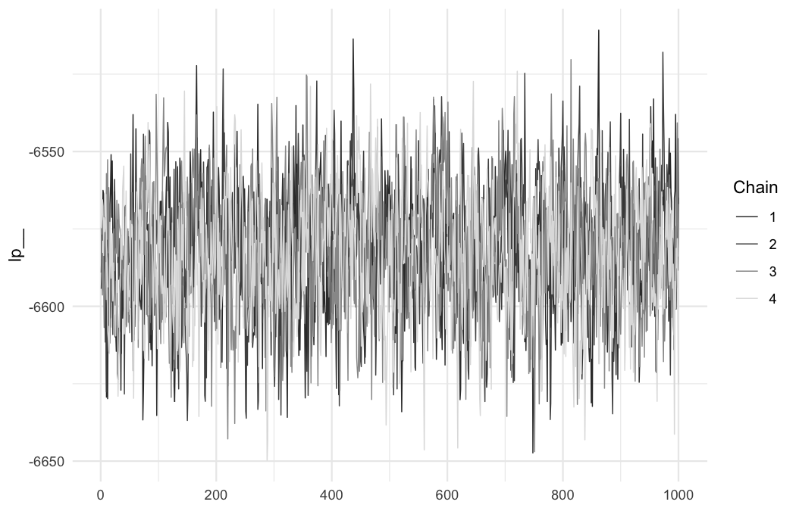
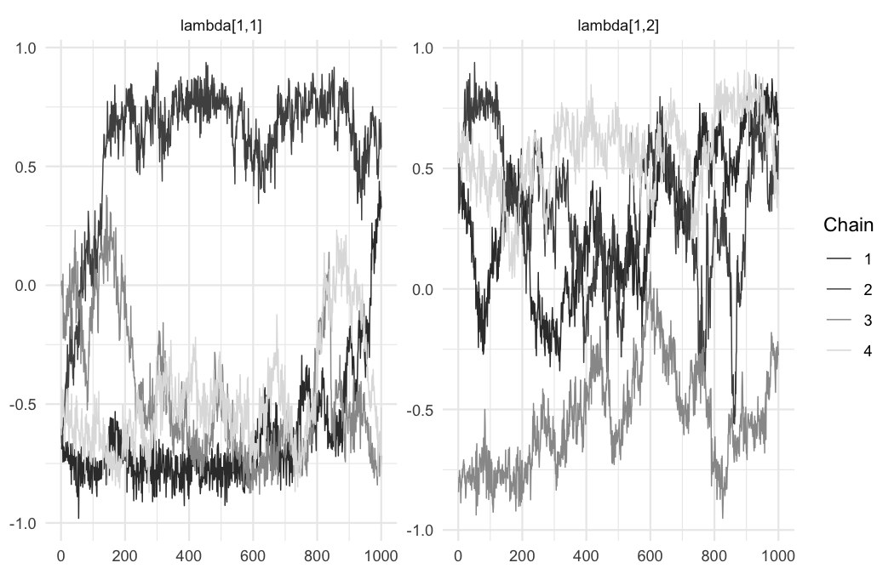
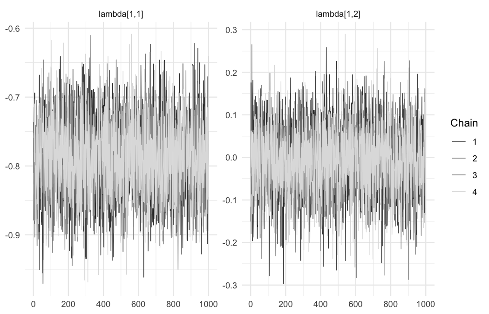
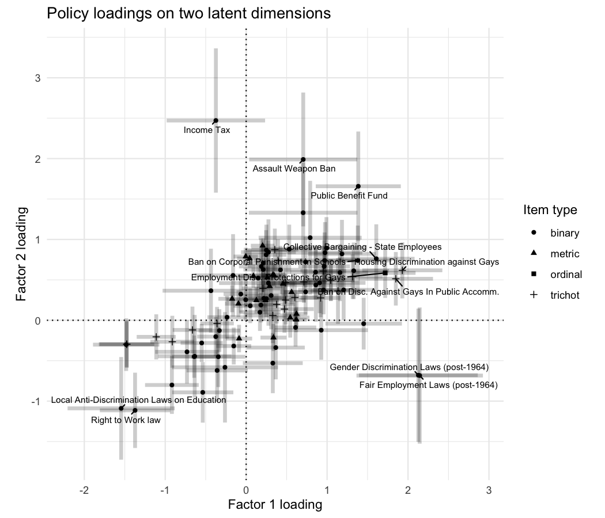
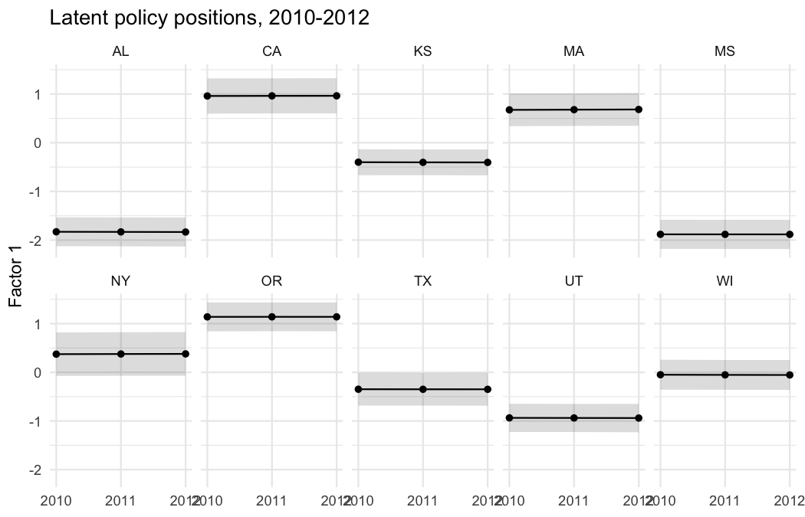
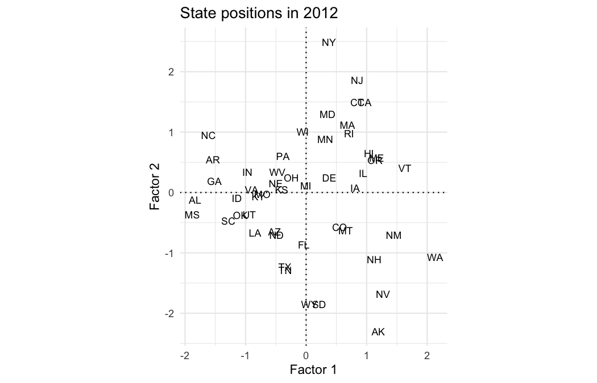

``` r
n_warmup <- 1000
n_sample <- 1000
```


``` r
library(dbmm)
library(dplyr)
library(tidyr)
library(ggplot2)
library(posterior)
library(bayesplot)

bayesplot::color_scheme_set("gray")
theme_set(theme_minimal(base_size = 11))
```

# The model

`fit_mixfac()` estimates a **dynamic factor model** for units observed
repeatedly on indicators that need not share a measurement scale. Let
$\eta_{tj} \in \mathbb{R}^D$ be the latent position of unit $j$ in period
$t$, and let $\lambda_i \in \mathbb{R}^D$ be the loadings of item $i$. The
linear predictor for unit $j$ on item $i$ in period $t$ is

$$
\nu_{tji} \;=\; \alpha_{ti} + \lambda_i' \eta_{tj},
$$

where $\alpha_{ti}$ is an item intercept that may either be held constant
across periods (`constant_alpha = TRUE`) or allowed to evolve. The
observation model depends on the item's measurement type:

| Type | Response | Model |
|------|----------|-------|
| Binary | $y \in \{0, 1\}$ | $\Pr(y = 1) = \Phi(\nu)$ |
| Trichotomous, ordinal | $y \in \{1, \dots, K\}$ | $\Pr(y \le k) = \Phi(\kappa_{ik} - \nu)$ |
| Metric | $y \in \mathbb{R}$ | $y \sim \mathcal{N}(\nu, \sigma_i^2)$ |

Latent positions evolve as a multivariate random walk,

$$
\eta_{tj} \;\sim\; \mathcal{N}\!\left(\eta_{t-1,j},\; \Omega\right),
$$

with innovation covariance $\Omega$ estimated from the data. Setting
`smooth_eta = FALSE` removes the random walk and estimates each period
independently.

Because $\lambda_i' \eta_{tj} = (\lambda_i' R)(R' \eta_{tj})$ for any
orthogonal $R$, the model is identified only up to rotation, reflection,
and permutation of the factors when $D > 1$. This package leaves the
sampler unconstrained and resolves the indeterminacy *after* sampling,
which is the subject of the identification section below.

# Data

`state_policies_2010_2012` records the policies of the 50 U.S. states from
2010 through 2012. Most policies are binary — does the state have the
policy in force or not? — but others are ordinal or continuous, which makes the data a natural application for a mixed-indicator model.


``` r
data("state_policies_2010_2012")

str(state_policies_2010_2012, vec.len = 2)
#> 'data.frame':	16500 obs. of  8 variables:
#>  $ year                     : int  2010 2010 2010 2010 2010 ...
#>  $ state_abb                : chr  "AK" "AL" ...
#>  $ state_name               : chr  "Alaska" "Alabama" ...
#>  $ policy_variable          : chr  "abortion_consent_1992_2014" "abortion_consent_1992_2014" ...
#>  $ policy_short_description : chr  "Forced counseling before abortions" "Forced counseling before abortions" ...
#>  $ policy_longer_description: chr  "Does the state mandate counseling before an abortion (post-Casey)?" "Does the state mandate counseling before an abortion (post-Casey)?" ...
#>  $ value                    : num  1 1 1 0 0 ...
#>  $ value_real               : num  1 1 1 0 0 ...
```

The columns we need are the unit (`state_abb`), period (`year`), item
(`policy_variable`), and response (`value_real`, which expresses monetary
quantities in constant dollars). Each item also carries a human-readable
description, which will be useful for labelling plots.


``` r
item_labels <- state_policies_2010_2012 |>
    distinct(policy_variable, policy_short_description) |>
    filter(!is.na(policy_short_description))

head(item_labels, 4)
#>              policy_variable           policy_short_description
#> 1 abortion_consent_1992_2014 Forced counseling before abortions
#> 2          abortion_medicaid              Medicaid for Abortion
#> 3            concealed_carry   Concealed Carry for Guns Allowed
#> 4               drugs_kegreg  Beer Keg Registration Requirement
```

## Checking the data before shaping

`shape_mixfac()` calls `check_mixfac_data()` on its input, which reports
problems that would otherwise pass silently: duplicated unit-period-item
combinations, items with no variation or observed in only one period, sparse
response categories in ordered items, and unobserved intermediate levels.
The same function can be run beforehand to inspect data on its own. Here we
look at a few of them.


``` r
anyDuplicated(state_policies_2010_2012[c("state_abb", "year",
                                         "policy_variable")])
#> [1] 0
```


``` r
policies <- state_policies_2010_2012 |>
    filter(!is.na(value_real))

nrow(state_policies_2010_2012) - nrow(policies)
#> [1] 12
```

Not every policy is observed in every state-year. Missing observations are
simply absent from the long data: the model conditions on what is
observed, and the dynamic prior interpolates the rest.


``` r
policies |>
    count(policy_variable, name = "n_obs") |>
    count(n_obs, name = "n_items")
#>   n_obs n_items
#> 1    50       1
#> 2   100       1
#> 3   147       4
#> 4   150     105
```


``` r
policies |>
    count(policy_variable, year) |>
    count(policy_variable, name = "n_years") |>
    filter(n_years < 3)
#>                  policy_variable n_years
#> 1 gayrights_ban_localprotections       2
#> 2       z_tanf_paymentsperfamily       1
```

Two policies are observed in fewer than all three years. They still inform
the loadings, but contribute little or nothing to the estimated dynamics.
`check_mixfac_data()` warns about the more extreme case, where an item appears in a single period.

# Step 1: Shape the data

`shape_mixfac()` converts the long data frame into the list Stan expects,
sorting observations by item type and recording the labels needed to
interpret the output. By default it classifies items automatically: two
distinct values means binary, three means trichotomous, four to `max_cats`
means ordinal, and anything else is metric.

The automatic classification counts distinct values, which can misfire. Here
`x_chip_pregnantwomen` records a CHIP income-eligibility threshold — a
continuous quantity — but takes nine distinct values across the 50 states.
Under earlier versions of this package, which classified anything with up to
ten distinct values as ordinal, it was treated as a nine-category ordinal
item. Several of those categories held only a handful of observations, the
cutpoints bounding them drifted to implausible magnitudes, and the resulting
rejected proposals left the two-dimensional fit badly mixed. The default
`max_cats = 5` now classifies it as metric, but it is worth naming the
genuinely ordinal items explicitly even where, as here, the default would have classified it correctly.


``` r
shaped <- shape_mixfac(
    long_data           = policies,
    unit_var            = "state_abb",
    time_var            = "year",
    item_var            = "policy_variable",
    value_var           = "value_real",
    periods_to_estimate = 2010:2012,
    standardize         = TRUE,
    make_indicator_for_zeros = FALSE,
    ordinal_items       = "w4_gayrights_employment_discrimination"
)
#> Warning: 3 items have fewer than two distinct values and will be dropped.
#> ℹ "genderrights_nofault_divorce", "regulation_vaccines", and "regulations_lemonlaw"
#> Warning: 1 item is observed in only one of 3 periods.
#> ℹ It informs the loadings but contributes nothing to the estimated dynamics.
#> ℹ "z_tanf_paymentsperfamily"
#> Warning: 2 ordered items have response categories with fewer than 3 observations.
#> ! Cutpoints bounding sparse categories are weakly identified, and can take implausible values and
#>   impede sampling.
#> ℹ Consider collapsing categories, or naming the genuinely ordinal items in `ordinal_items`.
#> ℹ "w_death_penalty" and "w_labor_paid_leave"
#> ℹ Categorizing 64 items as binary.
#> • abortion_consent_1992_2014
#> • abortion_medicaid
#> • concealed_carry
#> • drugs_kegreg
#> • drugs_medical_marijuana
#> • drugs_smoking_ban_restaurants
#> • drugs_smoking_ban_workplaces
#> • earned_income_taxcredit
#> • education_charter_schools
#> • education_corporal_punishment_ban
#> • education_vouchers
#> • environment_bottlebill
#> • environment_ca_car_emissions_standards
#> • environment_electronic_waste
#> • environment_ghg_cap
#> • environment_publicbenefit_funds
#> • environment_state_nepas
#> • environment_utility_deregulation
#> • estate_tax
#> • gambling_casinos
#> • gambling_lottery_adoption
#> • gayrights_ban_localprotections
#> • gayrights_ban_localprotections_schools
#> • gayrights_hatecrimes
#> • gayrights_jointadoption
#> • genderrights_era_ratification
#> • genderrights_gender_discrimination_laws_post1964
#> • genderrights_state_eras
#> • guncontrol_assaultweapon_ban
#> • guncontrol_licenses_dealers
#> • guncontrol_opencarry
#> • guncontrol_redflag_laws
#> • guncontrol_satnightspecial_ban
#> • guncontrol_stand_your_ground
#> • immigration_driverslicense
#> • immigration_english_language
#> • immigration_instate_tuition_illegalimmigrants
#> • income_taxes
#> • labor_age_discrimination
#> • labor_collective_bargaining_stateemployees
#> • labor_collective_bargaining_teachers
#> • labor_minimumwage_preemption
#> • labor_pla_preemption
#> • labor_prevailing_wage_laws
#> • labor_prevailingwage_preemption
#> • labor_right_to_work
#> • labor_state_disability_insurance
#> • medicaid_expansion
#> • race_fair_employment_commissions_post1964
#> • regulation_bicycle_helmets
#> • regulation_hate_crimes
#> • regulation_mandatory_car_insurance
#> • regulation_mandatory_seatbelts
#> • regulation_motorcycle_helmets
#> • regulation_pain_suffering_limits
#> • regulation_physician_suicide
#> • regulation_rent_control
#> • regulation_rfra
#> • regulation_shield
#> • tanf_work_requirement
#> • w_drugs_marijuana_legalization
#> • w_education_tencommandments
#> • w_immigration_publicbenefits_undocumented_kids
#> • w_regulation_contraceptives
#> ℹ Categorizing 24 items as trichotomous.
#> • gayrights_conversion_therapy
#> • w_abortion_parental_notice_1983_2014
#> • w_abortion_ultrasound
#> • w_abortion_waiting_period
#> • w_animal_cruelty_felony
#> • w_death_penalty
#> • w_ec_access
#> • w_education_moment_of_silence
#> • w_environment_endangered_species
#> • w_environment_solar_taxcredit
#> • w_environment_state_rps
#> • w_gayrights_civilunions_marriage
#> • w_gayrights_credit_discrimination
#> • w_gayrights_fosterparents
#> • w_gayrights_housing_discrimination
#> • w_gayrights_public_accomodations
#> • w_guncontrol_bc_privatesales
#> • w_guncontrol_waitingperiod
#> • w_immigration_everify
#> • w_immigration_sanctuary_states
#> • w_labor_paid_leave
#> • w_race_disc_public_accommodations2
#> • w_regulation_ban_the_box
#> • w5_abortion_laws
#> ℹ Categorizing 1 item as ordinal.
#> • w4_gayrights_employment_discrimination
#> ℹ Categorizing 19 items as metric.
#> • x_capital_gains_rich
#> • x_chip_children
#> • x_chip_infants
#> • x_chip_pregnantwomen
#> • x_eitc_refundable_levels
#> • x_labor_minwage_abovefed
#> • x_rps_targets_bindingonly
#> • x_sales_taxes
#> • x_tax_burden
#> • x_tax_rate_rich
#> • x_top_corporateincometaxrate
#> • z_cigarette_taxes
#> • z_education_expenditures_per_pupil
#> • z_education_higher_edu_spending
#> • z_gasoline_tax
#> • z_labor_unemployment_compensation
#> • z_tanf_initialelig
#> • z_tanf_maxpayment
#> • z_tanf_paymentsperfamily
```

Two trichotomous items have a response category with fewer than three
observations — a handful of states in a middle or extreme category — which
`check_mixfac_data()` flags. With only two cutpoints and 150 observations
apiece the risk is modest, so we proceed, but the check is worth heeding when
the affected items have many categories.


``` r
c(units   = shaped$J,
  periods = shaped$T,
  binary  = shaped$I_binary,
  trichot = shaped$I_trichot,
  ordinal = shaped$I_ordinal,
  metric  = shaped$I_metric)
#>   units periods  binary trichot ordinal  metric 
#>      50       3      64      24       1      19
```

The classification can be overridden with the `binary_items`,
`trichotomous_items`, and `ordinal_items` arguments, each of which takes a
character vector of item names.

Two further options are worth knowing about. `standardize = TRUE` rescales
each metric item to mean zero and unit variance, putting the loadings of
metric and non-metric items on a comparable footing.
`make_indicator_for_zeros = TRUE` — the default, disabled here so that the
item counts above are easy to follow — treats metric items bounded below at
zero as zero-inflated: observations at zero are set missing, and a new
binary item suffixed `_zi` records whether the response exceeded zero. That
is often the right model for policy instruments many states simply do not
use, such as a state earned income tax credit.

# Step 2: Fit the model


``` r
fit2 <- fit_mixfac(
    shaped_data     = shaped,
    n_dim           = 2,
    constant_alpha  = TRUE,
    smooth_eta      = TRUE,
    gen_log_lik     = TRUE,
    chains          = 4,
    parallel_chains = 4,
    iter_warmup     = n_warmup,
    iter_sampling   = n_sample,
    adapt_delta     = 0.9,
    refresh         = 0,
    seed            = 123,
    show_exceptions = FALSE
)
#> Running MCMC with 4 parallel chains...
#> 
#> Chain 1 finished in 451.1 seconds.
#> Chain 3 finished in 460.7 seconds.
#> Chain 4 finished in 497.9 seconds.
#> Chain 2 finished in 703.8 seconds.
#> 
#> All 4 chains finished successfully.
#> Mean chain execution time: 528.4 seconds.
#> Total execution time: 704.0 seconds.
```

Arguments beyond those documented in `?fit_mixfac` are passed through to
**cmdstanr**'s `$sample()` method, so `parallel_chains`, `adapt_delta`, and
`refresh` behave as they do there. `gen_log_lik = TRUE` adds a
per-observation log likelihood for the cross-validation in the last
section; it is off by default because it can dominate the size of the
output.


``` r
fit2$fit$time()$total
#> [1] 703.9577
```

During warmup the sampler can propose extreme parameter values, and Stan
reports the resulting rejected proposals at length. `show_exceptions = FALSE`
suppresses those messages while leaving genuine warnings — divergences,
treedepth saturation, low E-BFMI — visible. The diagnostics below are the
ones to check.


``` r
fit2$fit$diagnostic_summary()
#> $num_divergent
#> [1] 0 0 0 0
#> 
#> $num_max_treedepth
#> [1] 0 0 0 0
#> 
#> $ebfmi
#> [1] 0.9574604 0.8959065 0.9056251 0.9747177
```

# Step 3: Extract draws


``` r
draws_raw <- extract_mixfac_draws(fit2)

names(draws_raw)
#>  [1] "lp__"           "kappa_trichot"  "kappa_ordinal"  "sigma_metric"  
#>  [5] "eta"            "alpha_binary"   "alpha_ordinal"  "alpha_trichot" 
#>  [9] "alpha_metric"   "lambda_binary"  "lambda_trichot" "lambda_ordinal"
#> [13] "lambda_metric"  "Omega"          "log_lik"
```

The log posterior density `lp__` is invariant to the rotational
indeterminacy discussed above, which makes it the right quantity to check
first. If the chains agree on `lp__`, they have found the same posterior
even though their factor solutions may be arbitrarily rotated relative to
one another.


``` r
summarize_draws(subset_draws(draws_raw, "lp__"))
#> # A tibble: 1 × 10
#>   variable   mean median    sd   mad     q5    q95  rhat ess_bulk ess_tail
#>   <chr>     <dbl>  <dbl> <dbl> <dbl>  <dbl>  <dbl> <dbl>    <dbl>    <dbl>
#> 1 lp__     -6583. -6583.  20.2  20.6 -6617. -6551.  1.00    1230.    2326.
mcmc_trace(as_draws_array(subset_draws(draws_raw, "lp__")))
```

<div class="figure">

<p class="caption">plot of chunk diagnostics-lp</p>
</div>

Individual loadings, by contrast, need not agree at all.


``` r
lambda_raw <- as_draws_array(draws_rvars(lambda = draws_raw$lambda_metric))
mcmc_trace(lambda_raw, pars = c("lambda[1,1]", "lambda[1,2]"))
```

<div class="figure">

<p class="caption">plot of chunk diagnostics-raw</p>
</div>

The chains are exploring different rotations of the same likelihood, so
convergence diagnostics computed on the raw draws are meaningless.


``` r
summarize_draws(lambda_raw, "rhat", "ess_bulk") |>
    summarize(across(c(rhat, ess_bulk), list(min = min, max = max)))
#> # A tibble: 1 × 4
#>   rhat_min rhat_max ess_bulk_min ess_bulk_max
#>      <dbl>    <dbl>        <dbl>        <dbl>
#> 1     1.52     1.94         5.54         7.16
```

# Step 4: Identify the model

`identify_mixfac()` resolves the indeterminacy in two steps. It applies a
**varimax rotation** to each draw's loading matrix, seeking a sparse
solution in which each item loads strongly on few factors. It then finds
the **signed permutation** of factors that best aligns each draw with a
common reference, using `factor.switching::rsp_exact()`. Both
transformations are orthogonal, so every linear predictor $\nu_{tji}$ — and
therefore the likelihood — is left exactly unchanged.


``` r
draws_id <- identify_mixfac(draws_raw, method = "varimax", seed = 123)
```

The rotation is deterministic by default (`random_starts = 0`). Setting
`random_starts` above zero guards against local minima of the rotation
criterion at proportionate computational cost; `seed` makes those random
starts reproducible.


``` r
lambda_id <- as_draws_array(draws_rvars(lambda = draws_id$lambda_metric))
mcmc_trace(lambda_id, pars = c("lambda[1,1]", "lambda[1,2]"))
```

<div class="figure">

<p class="caption">plot of chunk identify-1</p>
</div>


``` r
summarize_draws(lambda_id, "rhat", "ess_bulk") |>
    summarize(across(c(rhat, ess_bulk), list(min = min, max = max)))
#> # A tibble: 1 × 4
#>   rhat_min rhat_max ess_bulk_min ess_bulk_max
#>      <dbl>    <dbl>        <dbl>        <dbl>
#> 1    0.999     1.00        3375.        7863.
```

The chains now agree. This is the point at which convergence should be
assessed, and it is worth checking every parameter rather than the
loadings alone.


``` r
summarize_draws(draws_id) |>
    summarize(max_rhat = max(rhat, na.rm = TRUE),
              min_ess  = min(ess_bulk, na.rm = TRUE))
#> # A tibble: 1 × 2
#>   max_rhat min_ess
#>      <dbl>   <dbl>
#> 1     1.01   1230.
```

## Labelling, combining, ordering, and signing

Four further steps make the draws easier to work with. `label_mixfac()`
attaches state, year, and item names. `combine_types_mixfac()` stacks the
type-specific loading and intercept variables into single `lambda` and
`alpha` variables, prefixing item names with their type. `sort_mixfac()`
orders factors by their sums of squared loadings, so that the first factor
is the one explaining the most variation. `sign_mixfac()` flips each factor
so that its mean loading is positive. The last two are again
reparameterizations that leave the likelihood untouched.


``` r
draws_final <- draws_id |>
    label_mixfac() |>
    combine_types_mixfac() |>
    sort_mixfac() |>
    sign_mixfac(signs = 1)

class(draws_final)
#> [1] "mixfac_signed" "mixfac_sorted" "mixfac_comb"   "draws_rvars"   "draws"        
#> [6] "list"
```


``` r
attr(draws_final, "factor order")
#> [1] 2 1
attr(draws_final, "sign flips")
#>  1  2 
#>  1 -1
```

# Step 5: Summarize

`summarize_mixfac()` applies a standard battery of posterior summaries to
each variable.


``` r
summ <- summarize_mixfac(draws_final)
names(summ)
#> [1] "eta"           "lambda"        "alpha"         "kappa_trichot" "kappa_ordinal"
#> [6] "sigma_metric"  "Omega"         "lp__"

summ$Omega
#> # A tibble: 4 × 10
#>   variable        mean   median      sd     mad       q5     q95  rhat ess_bulk ess_tail
#>   <chr>          <dbl>    <dbl>   <dbl>   <dbl>    <dbl>   <dbl> <dbl>    <dbl>    <dbl>
#> 1 Omega[1,1]  0.000819  4.36e-4 1.08e-3 5.38e-4  1.74e-5 2.88e-3  1.00    2037.    1978.
#> 2 Omega[2,1] -0.000190 -2.70e-5 7.30e-4 3.00e-4 -1.50e-3 6.49e-4  1.00    4348.    3390.
#> 3 Omega[1,2] -0.000190 -2.70e-5 7.30e-4 3.00e-4 -1.50e-3 6.49e-4  1.00    4348.    3390.
#> 4 Omega[2,2]  0.000773  4.24e-4 1.02e-3 5.14e-4  1.57e-5 2.71e-3  1.00    2790.    1757.
```

Because `whiten_eta = TRUE` fixes the cross-sectional covariance of the
period-1 factor scores to the identity, the between-state standard deviation
is 1 by construction, and latent distances are measured in units of it. The
innovation standard deviations of roughly 0.03 therefore say that a state
moves about three per cent of the between-state spread from one year to the
next: policy is sticky, as expected over three years.


``` r
## Average each state over periods, then take the SD across states, per factor
eta_bar <- rvar_apply(draws_final$eta, c(2, 3), rvar_mean)   # [J, D]

tibble(
    factor            = 1:2,
    sd_between_states = rvar_apply(eta_bar, 2, rvar_sd),
    sd_innovation     = sqrt(diag(E(draws_final$Omega)))
)
#> # A tibble: 2 × 3
#>   factor sd_between_states sd_innovation
#>    <int>        <rvar[1d]>         <dbl>
#> 1      1        1 ± 0.0033        0.0286
#> 2      2        1 ± 0.0029        0.0278
```

# Step 6: Visualize

Both `lambda` and `eta` hold `rvar` draws, which a small helper turns into
a data frame of posterior means and standard deviations.


``` r
tidy_rvar <- function(x, name = "value") {
    out <- as.data.frame.table(x, responseName = name)
    out$est <- E(out[[name]])
    out$err <- posterior::sd(out[[name]])
    out[[name]] <- NULL
    out
}
```

## Item loadings


``` r
lambda_df <- tidy_rvar(draws_final$lambda) |>
    pivot_wider(id_cols = item, names_from = factor,
                values_from = c(est, err)) |>
    separate_wider_delim(item, delim = ": ",
                         names = c("item_type", "policy_variable")) |>
    left_join(item_labels, by = "policy_variable")

head(lambda_df, 4)
#> # A tibble: 4 × 7
#>   item_type policy_variable              est_1  est_2 err_1 err_2 policy_short_descrip…¹
#>   <chr>     <chr>                        <dbl>  <dbl> <dbl> <dbl> <chr>                 
#> 1 binary    abortion_consent_1992_2014 -1.48   -0.301 0.209 0.166 Forced counseling bef…
#> 2 binary    abortion_medicaid           1.33    0.612 0.222 0.178 Medicaid for Abortion 
#> 3 binary    concealed_carry             0.329  -0.530 0.189 0.190 Concealed Carry for G…
#> 4 binary    drugs_kegreg                0.0504  0.179 0.105 0.109 Beer Keg Registration…
#> # ℹ abbreviated name: ¹​policy_short_description
```


``` r
label_these <- lambda_df |>
    slice_max(est_1^2 + est_2^2, n = 12)

ggplot(lambda_df, aes(x = est_1, y = est_2)) +
    geom_vline(xintercept = 0, linetype = "dotted") +
    geom_hline(yintercept = 0, linetype = "dotted") +
    geom_linerange(aes(xmin = est_1 - 1.96 * err_1,
                       xmax = est_1 + 1.96 * err_1),
                   alpha = 1/5, linewidth = 1.5) +
    geom_linerange(aes(ymin = est_2 - 1.96 * err_2,
                       ymax = est_2 + 1.96 * err_2),
                   alpha = 1/5, linewidth = 1.5) +
    geom_point(aes(shape = item_type)) +
    ggrepel::geom_text_repel(
        data = label_these,
        aes(label = coalesce(policy_short_description, policy_variable)),
        size = 2.6, max.overlaps = 20, min.segment.length = 0
    ) +
    labs(x = "Factor 1 loading", y = "Factor 2 loading",
         shape = "Item type",
         title = "Policy loadings on two latent dimensions") +
    coord_fixed()
```

<div class="figure">

<p class="caption">plot of chunk visualize-loadings</p>
</div>

Interpretation comes from the items at the extremes of each axis. A first
factor on which most social and economic policies load in the same
direction is the familiar single dimension of state policy liberalism; a
second factor separating, say, social-regulatory items from fiscal ones
would indicate that a single dimension does not suffice.

## Latent positions over time


``` r
eta_df <- tidy_rvar(draws_final$eta) |>
    mutate(period = as.integer(as.character(period)))

show_states <- c("MA", "NY", "CA", "OR", "TX", "AL", "MS", "UT", "KS", "WI")

eta_df |>
    filter(unit %in% show_states, factor == 1) |>
    ggplot(aes(x = period, y = est, group = unit)) +
    geom_ribbon(aes(ymin = est - 1.96 * err, ymax = est + 1.96 * err),
                alpha = 1/6) +
    geom_line() +
    geom_point() +
    facet_wrap(~ unit, nrow = 2) +
    scale_x_continuous(breaks = 2010:2012, minor_breaks = NULL) +
    labs(x = NULL, y = "Factor 1",
         title = "Latent policy positions, 2010-2012")
```

<div class="figure">

<p class="caption">plot of chunk visualize-eta</p>
</div>


``` r
eta_df |>
    filter(period == 2012) |>
    pivot_wider(id_cols = unit, names_from = factor,
                values_from = c(est, err)) |>
    ggplot(aes(x = est_1, y = est_2, label = unit)) +
    geom_vline(xintercept = 0, linetype = "dotted") +
    geom_hline(yintercept = 0, linetype = "dotted") +
    geom_text(size = 3) +
    labs(x = "Factor 1", y = "Factor 2",
         title = "State positions in 2012") +
    coord_fixed()
```

<div class="figure">

<p class="caption">plot of chunk visualize-scatter</p>
</div>

With only three periods the random walk is weakly identified: there are
just two transitions per state from which to learn $\Omega$, so the
posterior for the innovation variance will be dominated by its prior.
Applications with longer panels will show considerably more movement, and
`sd_sigma_eta_evol` is the argument that governs how strongly that movement
is shrunk toward zero.

# Step 7: How many factors?

`loo_mixfac()` computes approximate leave-one-out cross-validation from the
`log_lik` generated by `gen_log_lik = TRUE`. Log-likelihood contributions
are aggregated by **unit-item dyad** by default, meaning that all periods
of one policy for one state are held out together.

That default is deliberate. If single observations were held out, a
response could be predicted almost perfectly from the same state and policy
in an adjacent year, because both the item intercepts and the factor scores
evolve smoothly — the comparison would measure temporal interpolation
rather than factor structure. Holding out the whole dyad forces prediction
from the state's responses to *other* policies, which is what the loadings
govern.


``` r
fit1 <- fit_mixfac(
    shaped_data = shaped, n_dim = 1, constant_alpha = TRUE,
    smooth_eta = TRUE, gen_log_lik = TRUE,
    chains = 4, parallel_chains = 4,
    iter_warmup = n_warmup, iter_sampling = n_sample,
    refresh = 0, seed = 123, show_exceptions = FALSE
)
#> Running MCMC with 4 parallel chains...
#> 
#> Chain 2 finished in 239.2 seconds.
#> Chain 1 finished in 251.4 seconds.
#> Chain 4 finished in 253.8 seconds.
#> Chain 3 finished in 257.6 seconds.
#> 
#> All 4 chains finished successfully.
#> Mean chain execution time: 250.5 seconds.
#> Total execution time: 257.9 seconds.
summarize_draws(subset_draws(fit1$fit$draws(), "lp__"))
#> # A tibble: 1 × 10
#>   variable   mean median    sd   mad     q5    q95  rhat ess_bulk ess_tail
#>   <chr>     <dbl>  <dbl> <dbl> <dbl>  <dbl>  <dbl> <dbl>    <dbl>    <dbl>
#> 1 lp__     -7108. -7107.  14.9  14.9 -7133. -7085.  1.00    1403.    2256.
```


``` r
loo1 <- loo_mixfac(fit1, group = "dyad")
#> Warning: Some Pareto k diagnostic values are too high. See help('pareto-k-diagnostic') for details.
loo2 <- loo_mixfac(fit2, group = "dyad")
#> Warning: Some Pareto k diagnostic values are too high. See help('pareto-k-diagnostic') for details.

loo2
#> 
#> Computed from 4000 by 5396 log-likelihood matrix.
#> 
#>          Estimate    SE
#> elpd_loo  -9446.5 164.4
#> p_loo      1285.6  41.8
#> looic     18893.0 328.8
#> ------
#> MCSE of elpd_loo is NA.
#> MCSE and ESS estimates assume MCMC draws (r_eff in [0.4, 2.0]).
#> 
#> Pareto k diagnostic values:
#>                          Count Pct.    Min. ESS
#> (-Inf, 0.7]   (good)     5253  97.3%   79      
#>    (0.7, 1]   (bad)       106   2.0%   <NA>    
#>    (1, Inf)   (very bad)   37   0.7%   <NA>    
#> See help('pareto-k-diagnostic') for details.
```

The Pareto $k$ diagnostics indicate whether the importance sampling
underlying the approximation is reliable. Because each dyad bundles several
observations, some elevated values are expected.


``` r
table(cut(loo::pareto_k_values(loo2), c(-Inf, 0.5, 0.7, 1, Inf),
          labels = c("good", "ok", "bad", "very bad")))
#> 
#>     good       ok      bad very bad 
#>     4979      274      106       37
```

`loo_influential()` names the dyads responsible.


``` r
head(loo_influential(loo2, threshold = 0.7), 8)
#>                                                            group pareto_k      elpd_loo
#> 1 binary | genderrights_gender_discrimination_laws_post1964 | WA 3.754851 -5.868836e-08
#> 2        binary | race_fair_employment_commissions_post1964 | WA 3.646734 -4.276655e-08
#> 3                                     binary | income_taxes | NY 3.263738 -6.052564e-08
#> 4        binary | race_fair_employment_commissions_post1964 | AK 2.268949 -1.385142e-05
#> 5 binary | genderrights_gender_discrimination_laws_post1964 | AK 2.118219 -3.250092e-06
#> 6        binary | race_fair_employment_commissions_post1964 | NV 1.844691 -4.567430e-06
#> 7 binary | genderrights_gender_discrimination_laws_post1964 | NV 1.796833 -1.399260e-06
#> 8        binary | race_fair_employment_commissions_post1964 | NM 1.647839 -1.325608e-06
#>      n_eff
#> 1 2265.525
#> 2 2121.020
#> 3 4021.332
#> 4 2694.657
#> 5 3505.405
#> 6 3414.636
#> 7 3506.202
#> 8 3742.204
```

Note that high Pareto $k$ has two quite different causes here. The dyads at
the top of this list have `elpd_loo` values of essentially zero: the model
predicts them perfectly, because the state never changes its position on the
item, and the importance ratios are unstable for want of any variation to
weight. That is a separation artifact rather than a sign of poor fit. Dyads
with both high $k$ and substantially negative `elpd_loo` are the ones the
model genuinely struggles with.


``` r
loo::loo_compare(list(one_factor = loo1, two_factor = loo2))
#>       model elpd_diff se_diff p_worse diag_diff        diag_elpd
#>  two_factor       0.0     0.0      NA           143 k_psis > 0.7
#>  one_factor    -350.9    62.1    1.00            47 k_psis > 0.7
#> 
#> Diagnostic flags present.
#> See ?`loo-glossary` (sections `diag_diff` and `diag_elpd`)
#> or https://mc-stan.org/loo/reference/loo-glossary.html.
```

A difference in `elpd_diff` that is large relative to its standard error
favours the more complex model. Comparisons are valid only across models
fit to identical observations and grouped identically: varying `n_dim`,
`smooth_eta`, or `constant_alpha` is fine, but comparing fits to different
items or periods is not.

Other groupings are available through the `group` argument:
`"observation"`, `"unit"`, `"period"`, `"item"`, and `"item_type"`. For
assessing whether smoothing helps, `group = "observation"` is the more
direct test, since it asks precisely whether neighbouring periods of the
same state and policy improve prediction. Note that `group = "unit"` holds
out a state's entire response history, creating folds so large that
importance sampling is unreliable; K-fold cross-validation is preferable in
that case.

# Session information


``` r
sessionInfo()
#> R version 4.6.1 (2026-06-24)
#> Platform: aarch64-apple-darwin23
#> Running under: macOS Tahoe 26.5.2
#> 
#> Matrix products: default
#> BLAS:   /Library/Frameworks/R.framework/Versions/4.6/Resources/lib/libRblas.0.dylib 
#> LAPACK: /Library/Frameworks/R.framework/Versions/4.6/Resources/lib/libRlapack.dylib;  LAPACK version 3.12.1
#> 
#> locale:
#> [1] en_US.UTF-8/en_US.UTF-8/en_US.UTF-8/C/en_US.UTF-8/en_US.UTF-8
#> 
#> time zone: America/New_York
#> tzcode source: internal
#> 
#> attached base packages:
#> [1] stats     graphics  grDevices utils     datasets  methods   base     
#> 
#> other attached packages:
#> [1] bayesplot_1.15.0 posterior_1.7.0  ggplot2_4.0.3    tidyr_1.3.2      dplyr_1.2.1     
#> [6] dbmm_0.1.0      
#> 
#> loaded via a namespace (and not attached):
#>  [1] gtable_0.3.6         tensorA_0.36.2.1     xfun_0.60            factor.switching_1.4
#>  [5] processx_3.9.0       ggrepel_0.9.8        lattice_0.22-9       vctrs_0.7.3         
#>  [9] tools_4.6.1          ps_1.9.3             generics_0.1.4       parallel_4.6.1      
#> [13] tibble_3.3.1         ca_0.71.1            cmdstanr_0.9.0       pkgconfig_2.0.3     
#> [17] Matrix_1.7-5         data.table_1.18.4    checkmate_2.3.4      RColorBrewer_1.1-3  
#> [21] S7_0.2.2             distributional_0.8.1 HDInterval_0.2.4     lifecycle_1.0.5     
#> [25] compiler_4.6.1       farver_2.1.2         stringr_1.6.0        GPArotation_2026.8-1
#> [29] MatrixModels_0.5-4   mcmc_0.9-8           codetools_0.2-20     SparseM_1.84-2      
#> [33] seriation_1.5.8      quantreg_6.1         pillar_1.11.1        MASS_7.3-65         
#> [37] iterators_1.0.14     TSP_1.2.7            abind_1.4-8          foreach_1.5.2       
#> [41] tidyselect_1.2.1     stringi_1.8.9        reshape2_1.4.5       purrr_1.2.2         
#> [45] labeling_0.4.3       splines_4.6.1        grid_4.6.1           cli_3.6.6           
#> [49] magrittr_2.0.5       loo_2.10.1           survival_3.8-6       utf8_1.2.6          
#> [53] withr_3.0.3          scales_1.4.0         backports_1.5.1      registry_0.5-1      
#> [57] matrixStats_1.5.0    otel_0.2.0           coda_0.19-4.1        evaluate_1.0.5      
#> [61] lpSolve_5.6.23       knitr_1.51           rlang_1.3.0          MCMCpack_1.7-1      
#> [65] Rcpp_1.1.2           glue_1.8.1           jsonlite_2.0.0       R6_2.6.1            
#> [69] plyr_1.8.9
```


